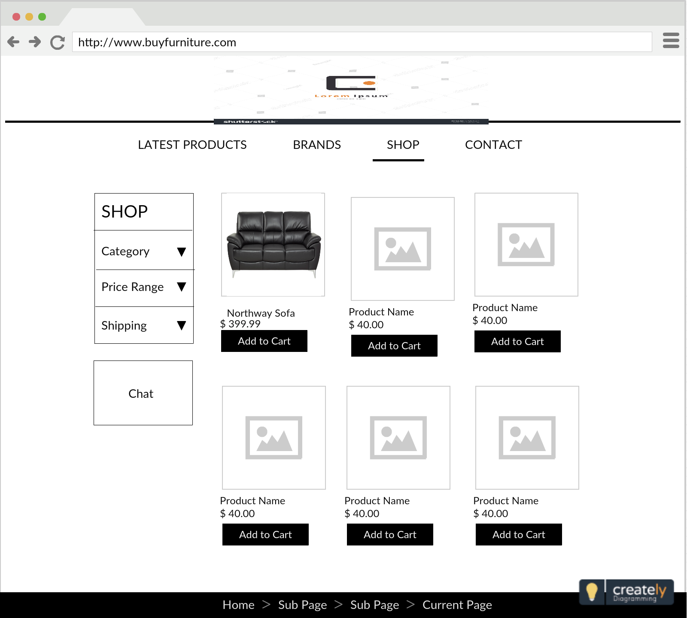

# Capstone

_A project in the works_

## Getting Started


### Prerequisites

What things you need to install

* React
* Javascript
* HTML
* CSS
* Bootstrap
* NPM
* Redux

### Installing

A step by step series of examples that tell you how to get a development env running

Say what the step will be

```
Give the example
```

And repeat

```
until finished
```

End with an example of getting some data out of the system or using it for a little demo

### Break down into end to end tests

Explain what these tests test and why

```
Give an example
```

## Deployment

Add additional notes about how to deploy this on a live system

## Built With

* [React](https://reactjs.org) - The front-end framework
* [Redux](https://redux.js.org) - Dependency Management

## Example WireFrame



## Author

* **Jim Palowski** - *Initial work* - [PurpleBooth](https://github.com/jimpalowski)

## License

This project is licensed under the MIT License - see the [LICENSE.md](LICENSE.md) file for details
